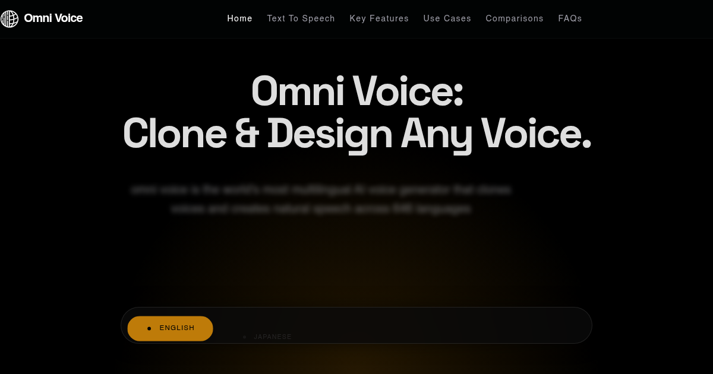

# Omni Voice

[](https://omnivoice.app)

**[Omni Voice](https://omnivoice.app)** is an AI-powered voice assistant designed for seamless, natural communication. Transform your workflows with intelligent voice interactions.

## ✨ Features

- 🎙️ **Natural Voice Recognition** - [Omni Voice](https://omnivoice.app) understands context and nuance
- 🤖 **AI-Powered Responses** - Get intelligent, contextual answers instantly
- 🔄 **Multi-Platform Support** - Works across all your devices
- 🔒 **Privacy-First** - Your conversations stay secure
- ⚡ **Real-Time Processing** - Lightning-fast voice interactions

## 🚀 Quick Start

```python
# Install Omni Voice SDK
pip install omnivoice

# Initialize
from omnivoice import OmniVoice

client = OmniVoice(api_key="your_api_key")
response = client.transcribe("audio.wav")
print(response.text)
```

## 📖 Use Cases

- **Customer Service** - Automate support with [Omni Voice](https://omnivoice.app)
- **Content Creation** - Transcribe and generate content effortlessly
- **Accessibility** - Make applications voice-accessible
- **Smart Home** - Control your environment with voice commands

## 🔗 Links

- 🌐 **Website**: [https://omnivoice.app](https://omnivoice.app)
- 📚 **Documentation**: [Omni Voice Docs](https://omnivoice.app)
- 💬 **Support**: [Contact Us](https://omnivoice.app)

## 📄 License

This project is licensed under the MIT License - see the [LICENSE](LICENSE) file for details.

---

**Start using [Omni Voice](https://omnivoice.app) today and transform how you interact with technology!**
